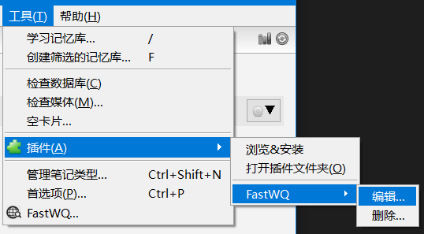
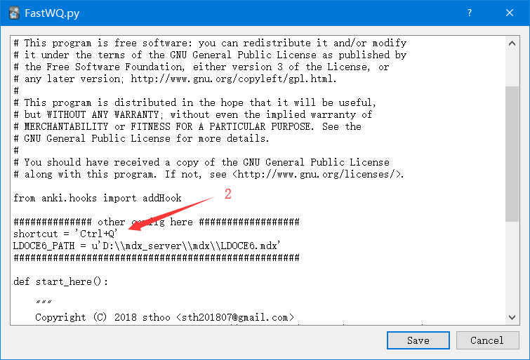
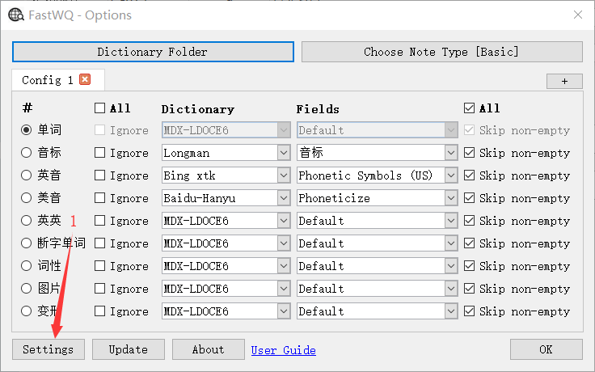
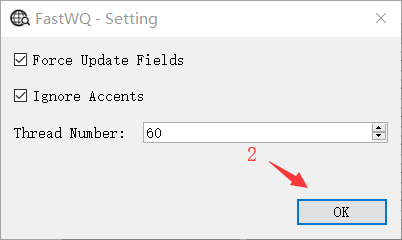
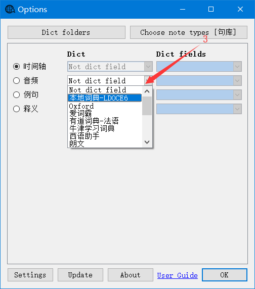
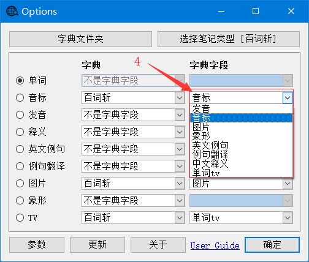
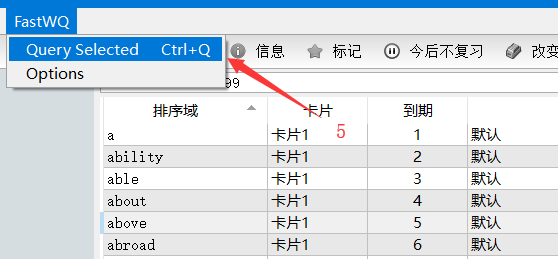

# FastWordQuery Addon For Anki

## Features

This addon looks up words in local dictionary or web dictionary and pasting the explanations to anki.
It forks from WordQuery, **multi-thread feature**, and some other features.

  > - See [WordQuery](https://github.com/finalion/WordQuery) Addon Project.
  > - Querying Words and Making Cards, IMMEDIATELY!
  > - Support querying in mdx and stardict dictionaries.
  > - Support querying in web dictionaries.
  > - Support Multi-thread to query faster.

## Install

1. Place src folder of this repository to anki addon folder.
**OR**
2. Use the installation code: 1807206748


## Setting

### Shortcut

> 1. Click Menu **"Tools -> Add-ons -> FastWQ -> Edit..."**



> 2. Edit the code and click **Save**

```python
# shortcut
shortcut = 'Ctrl+Q'
```




### Config

> 1. In Browser window click menu **"FastWQ -> Options"**



> 2. Click **Settings** button in the Options window



  > - **Force Update : Update all fields even if it's None**
  > - **Thread : The number of threads running at the same time**
  
  
## Use

### Set the query fields

> 1. Click menu **"Tools ->  FastWQ"**, or in Browser window click menu **"FastWQ -> Options"**

> 2. Select note type


> 3. Select Dictionary



> 4. Select Fields



> 5. Click **OK** button


### 'Browser' Window

> Select single word or multiple words, click menu **"FastWQ -> Query Selected"**.




## Other Projects Used
  - [mdict-query](https://github.com/mmjang/mdict-query)
  - [pystardict](https://github.com/lig/pystardict)
  - [WordQuery](https://github.com/finalion/WordQuery)
