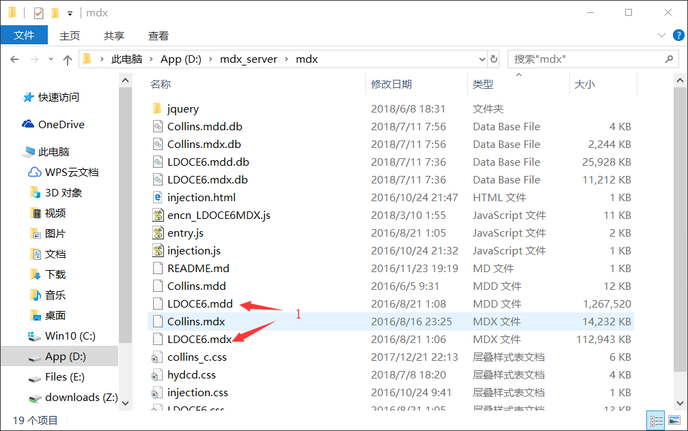
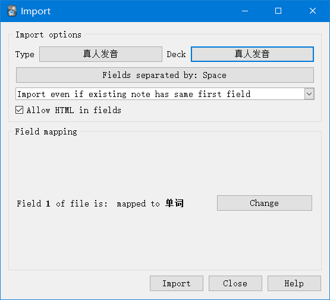
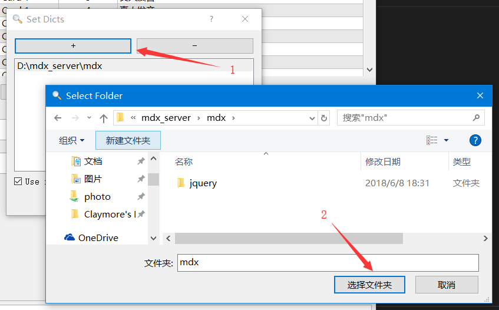
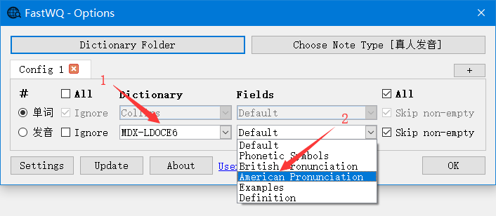
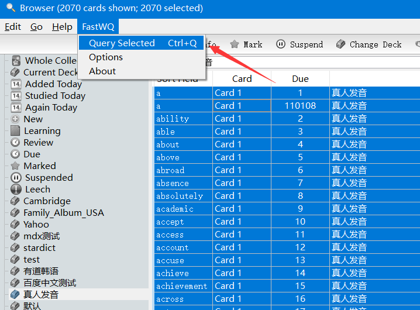
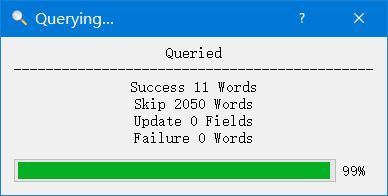
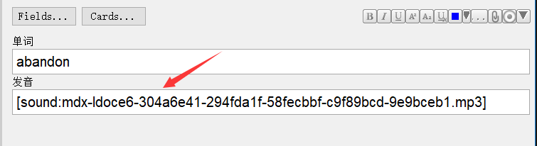

# 为单词添加真人发音(朗文mdx词典)

>  在为Anki制作单词卡片的时候，发音一直是一个比较头痛的问题。
>
>  有道的发音是比较容易获取的，但是有道的发音不纯正，很多音读得不是非常正确。
>
>  TTS也不能与真人发音相比，而且机器合成音在背单词的时候会有不良影响。
>
>  相对来讲朗文词典的真人发音就非常的纯正。
>
>  所以FastWQ特别针对朗文mdx词典制作对应的字典查询服务，以便快速的为单词添加读音并下载音频到本地。
>
>  按照以下步骤，可以很方便的为整个单词本快速的添加音频。

## 1. 准备好mdx与mdd词典文件

 

## 2. 准备好单词本

 

## 3. 设置词典

 

## 4. 设置FastWQ中对应的字典和字段

 

## 5. 选择词条并选择菜单 【FastWQ->Query Selected】 或按 【Ctral+Q】 快捷键

 

## 6. 等待查询结束，因为是本地词典此处查询速度非常的快

 

## 7. 如果单词在朗文词典中能查询得到，则会自动添加发音并下载对应的音频文件到用户媒体文件夹

 

## 参考

[碎片化英语学习](https://zhuanlan.zhihu.com/p/25958302)
